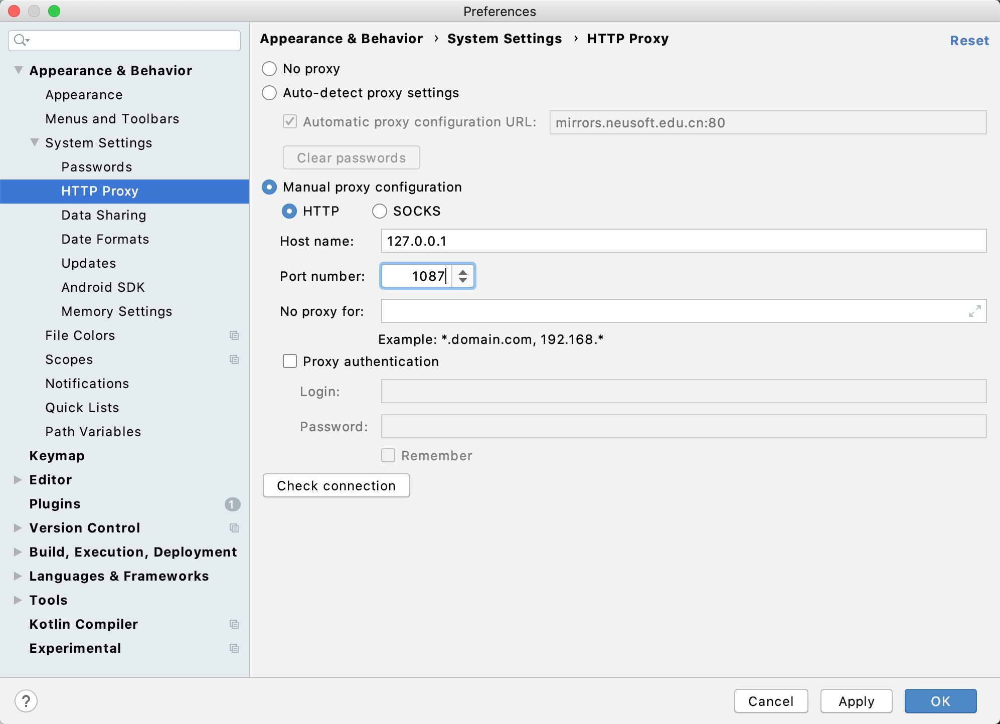
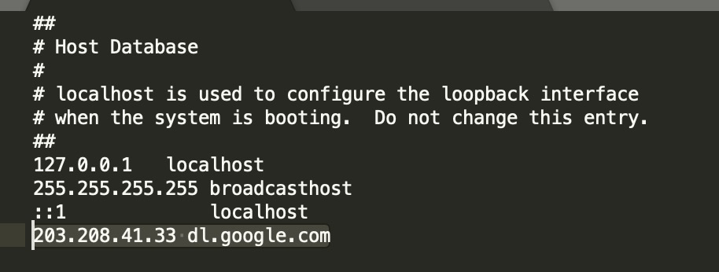
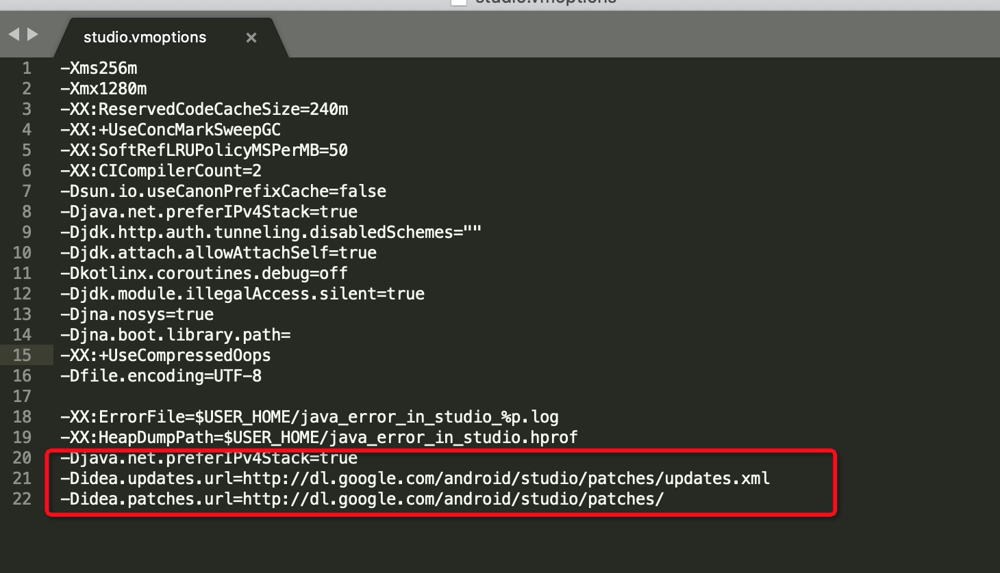

# Android Studio Mac上代理配置
> 国内的镜像在mac上都无法使用，可以通过如下方式解决：
## 使用V2Ray为 android studio 配置代理
1. Android studio >> Appearance & Behavior >> System Setting >> Http Proxy.
2. 选择&emsp;**"Manual proxy configuration"**&emsp;，然后选择&emsp;**"HTTP"**&emsp;.
3. 点击V2rayU >> Configure，在&emsp;**inbounds**&emsp;中找到如下的ip和端口号
```
 "listen": "127.0.0.1",
      "protocol": "http",
      "settings": {
        "timeout": 360
      },
      "port": "1087"
```
4. 分别将ip和端口号填入对应项中，点击OK
   

如果你的V2Ray服务器很快的话，可以采用直接代理，但是如果比较慢的话，例如100kb/s的网速，下载SDK的时间可能超乎你的想象。

## 配置hosts文件
1. 打开hosts文件 /etc/hosts, 并追加如下内容
`203.208.41.33 dl.google.com`



2. 修改studio.vmoptions文件 `/Applications/Android Studio.app/Contents/bin/studio.vmoptions`，并添加如下内容：
   ```

    -Djava.net.preferIPv4Stack=true  
    -Didea.updates.url=http://dl.google.com/android/studio/patches/updates.xml  
    -Didea.patches.url=http://dl.google.com/android/studio/patches/

   ```


   
3. 将android studio的代理关闭 选择 &emsp;**No proxy**&emsp;

可以在网站`http://ping.chinaz.com/`查找`dl.google.com`的ip地址，如果`203.208.41.33 `不可用的话，可以去该网站找到一个可用的。